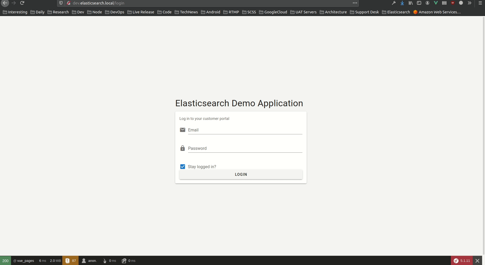

# README
#### Symfony / Elasticsearch / OAuth2 / Vue / VueX / Vuetify Demo Application

## Requirements
> Elastic Stack
- Docker & Docker Compose (Use docker-compose.yml)
    - Elasticsearch image - elasticsearch:7.12.1
    - Kibana image - kibana:7.10.2
> Backend 
- Nginx
- PHP 7.3
- Mysql 5.7
> Frontend
- Node ^14
- NPM ^6

> Main Symfony Packages Used
- ongr/elasticsearch-dsl 7.12.0
- ongr/elasticsearch-bundle 7.0.3
- trikoder/oauth2-bundle

> Main Vue Packages Used
- Vuetify
- VueX and VueX-Persist

## Setup Instructions

> Backend
- Clone: __git clone git@github.com:DushyanthaHerath/demo_elastics_symfony.git__
- cd __DIRECTORY__
- Copy __.env__ file and edit database credentials and __Elasticsearch Host__ & APP_URL
- Run __composer install__
- Run __php bin/console doctrine:database:create__
- Run __php bin/console doctrine:migrations:migrate__
- Run __php bin/console doctrine:fixtures:load__

> Elastic Stack
- Run __docker compose up__ (If you use docker-compose file included here)
- Add __ELASTICSEARCH_HOST__ to .env
- Add __Kibana__ Ecommerce dataset by going into Kibana (localhost:5601) then __Add Data__

> OAuth 2 Setup
- Run __php bin/console trikoder:oauth2:create-client__
- Add the generated __CLIENT_ID__ & __CLIENT_SECRET__ to the .env file

> Login (Change in Data Fixtures)
- Username: __user@test.com__
- Password: __password__
 

> Frontend
- Run __npm install__
- Run __npm run production__

> Postman Collection
- https://documenter.getpostman.com/view/15875743/TzRa7Pbh
- 

